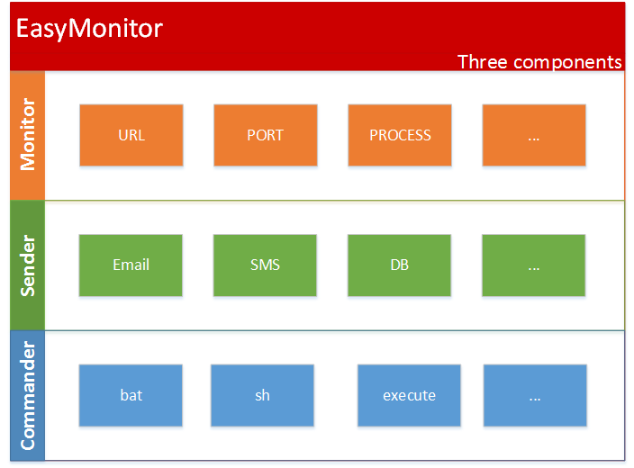
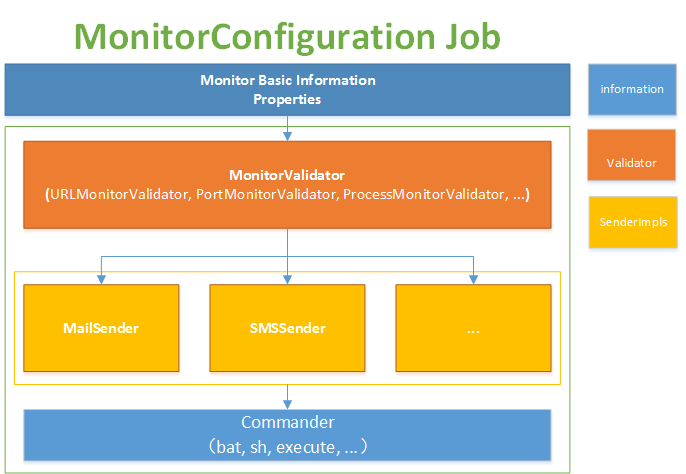
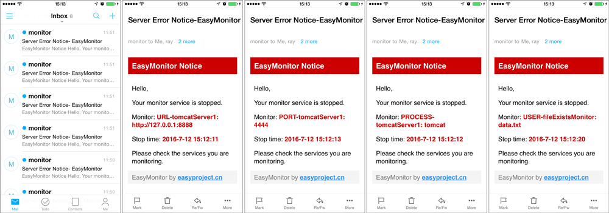

# EasyMonitor

EasyMonitor 是一个基于 Java 的免费开源跨平台系统运行监控服务应用及引擎框架。即可开箱即用(**EasyMonitor Application**)，又可以作为监控引擎框架扩展(**EasyMonitor Engine Framework**)。

EasyMonitor 能够为需要运行状态监控的程序场景提供一体化支持，提供集合了运行监控，通知发送，脚本执行等于功能。而这一切，仅需进行简单的配置管理即可完成。

最新版本： `1.3.0-RELEASE`

## EasyMonitor 特点

- **开箱即用的监控引擎框架**。
- **全面的类型监控**。支持 `URL`，`PORT`, `PROCESS`, `USER` 四种类型
- **自动重启检测**。监控到程序异常，对程序进行恢复后，无需重新启动 EasyMonitor
- **热加载**。支持运行期间热修改 `easymonitor.properties`，修改监控配置参数无需重启 EasyMonitor
- **灵活的调度配置**。支持基于 `CronExpression` 的监控任务调度
- **周期重复提醒**。可以配置监控异常提醒发送间隔，多次提醒，防止提醒疏漏
- **插件式扩展增强**。自定义监控验证器（`MonitorValidator`） 和发送者(`Sender`)
- **自定义通知模板**。基于 `freemarker` 的自定义通知模板，支持内置变量使用，更新模板自动重新加载
- **远程监控**。
- **配置简单灵活**。仅需简单配置管理，即可实现针对不同规则、敏感度、用途和场景服务的监控配置，消息通知，及命令脚本执行


## EasyMonitor 内部工作三大组件

- **Monitor（监控器）**
 可以配置针对 URL（URL 地址）， PORT（服务器端口），PROCESS（服务器进程），USER（用户自定义监控验证器） 四种类型服务的监控。

- **Sender（发送者）**
 当发现监控对象停止后，自动执行发送通知，执行 `Email`、 `SMS 短信` 通知等，一个监控服务可以有多个 Sender。

- **Commander（命令执行）**
 监控的服务发生异常时，执行指定的自定义脚本。



## MonitorConfiguration
- `MonitorConfiguration` 对象，封装了每一项监控服务所需的相关数据和配置信息（Basic），完全配置信息（Properties），监控验证器（MonitorValidator）和发送对象列表（SenderImpls）。

 

- EasyMonitor 会根据 `MonitorConfiguration` 对象，创建监控 Job。

 

## Properties

`easymonitor.properties` 是 EasyMonitor 的核心配置文件，配置了监控所需的所有信息。

### 配置结构


### **全局配置**（作为监控服务配置的全局默认值，可选）

```properties
# Monitor ON or OFF, default is ON
# 监控服务默认是否打开，默认为 ON
easymonitor.enable=ON

# Monitor trigger Cron-Expressions; default is '0/10 * * * * ?'
# 监控服务的默认调度 Cron-Expressions； 默认为 '0/10 * * * * ?'
easymonitor.cronexpression=0/10 * * * * ?

# Monitor max failure count; default is 10
# 判断监控服务是否异常的默认最大失败次数；默认为 10
easymonitor.maxfailure=10

# Receive Error Report mail address
# You can specify more than one, separated by a ##
# 接收监控通知提醒的邮箱列表，多个邮箱使用 ## 分隔
easymonitor.mail.receiver=yourmail@domain.com##youmail2@domai2.org

# Send Mail Account Config
# 邮箱发送者账户配置
# Send Mail Account
easymonitor.mail.sender=sendermail@domain.com
# Send Mail password
# 邮箱发送者密码
easymonitor.mail.sender.passowrd=mailpassword
# Send Mail SMTP host
# 邮箱发送者 host
easymonitor.mail.sender.host=smtp.163.com
# Send Mail SMTP port; default is 25
# 邮箱发送者 host 端口
easymonitor.mail.sender.port=25
# Send Mail Whether use SSL; default is false
# 是否使用了 SSL 协议
easymonitor.mail.sender.ssl=false
# Send Mail title
# 邮件发送标题
easymonitor.mail.sender.title=Server Error Notice- EasyMonitor
# The send mail content freemarker template in template directory, default is 'mail.tpl'
# template 目录下的邮件发送模板，默认为 mail.tpl
easymonitor.mail.sender.template=mail.tpl
# When error, repeat send mail interval(seconds); default is 0, not repeat
# 当监控服务发现错误时，是否按周期进行重复提醒（秒）；默认为 0，不进行重复提醒
easymonitor.mail.sender.interval=0

# Execute Command 
# You can specify more than one, separated by a ##
# 自动执行的脚本命令，多个脚本命令使用 ## 分隔
easymonitor.cmd=/user/app/startup.sh
```

### **监控服务配置**（可以覆盖全局配置的默认值）
- **url** 监控配置
- **port** 端口监控配置
- **process** 进程监控配置
- **user** 自定义监控配置

`NAME` 是自定义的监控服务名称，每个监控服务由一组相同 `NAME` 的配置项组成。

```properties
######################## Monitor Service configuration
easymonitor.[url|port|process|user].NAME=value
easymonitor.[url|port|process|user].NAME.enable=ON|OFF
easymonitor.[url|port|process|user].NAME.cronexpression=0/10 * * * * ?
easymonitor.[url|port|process|user].NAME.maxfailure=10
easymonitor.port.NAME.server=IP
easymonitor.user.NAME.validatorClass=package.MonitorValidatorClas

easymonitor.[url|port|process|user].NAME.cmd=/user/app/script.sh

easymonitor.[url|port|process|user].NAME.mail.receiver=receivermail@domain.com

easymonitor.[url|port|process|user].NAME.mail.sender=sendermail@domain.com
easymonitor.[url|port|process|user].NAME.mail.sender.passowrd=sendermail_password
easymonitor.[url|port|process|user].NAME.mail.sender.host=sendermail_host
easymonitor.[url|port|process|user].NAME.mail.sender.port=sendermail_port
easymonitor.[url|port|process|user].NAME.mail.sender.ssl=sendermail_ssh
easymonitor.[url|port|process|user].NAME.mail.sender.title=sendermail_title
easymonitor.[url|port|process|user].NAME.mail.sender.template=mail.tpl
easymonitor.[url|port|process|user].NAME.mail.sender.interval=1800

easymonitor.[url|port|process|user].NAME.sender.impl=userSenderClass##userSenderClass2
```


## 完全配置示例
```properties
######################## Global Config(Optional) 全局配置（可选）

# Monitor ON or OFF, default is ON
# 监控服务默认是否打开，默认为 ON
easymonitor.enable=ON

# Monitor trigger Cron-Expressions; default is '0/10 * * * * ?'
# 监控服务的默认调度 Cron-Expressions； 默认为 '0/10 * * * * ?'
easymonitor.cronexpression=0/10 * * * * ?

# Monitor max failure count; default is 10
# 判断监控服务是否异常的默认最大失败次数；默认为 10
easymonitor.maxfailure=10

# Receive Error Report mail address
# You can specify more than one, separated by a ##
# 接收监控通知提醒的邮箱列表，多个邮箱使用 ## 分隔
easymonitor.mail.receiver=yourmail@domain.com##youmail2@domai2.org

# Send Mail Account Config
# 邮箱发送者账户配置
# Send Mail Account
easymonitor.mail.sender=sendermail@domain.com
# Send Mail password
# 邮箱发送者密码
easymonitor.mail.sender.passowrd=mailpassword
# Send Mail SMTP host
# 邮箱发送者 host
easymonitor.mail.sender.host=smtp.domain.com
# Send Mail SMTP port; default is 25
# 邮箱发送者 host 端口
easymonitor.mail.sender.port=25
# Send Mail Whether use SSL; default is false
# 是否使用了 SSL 协议
easymonitor.mail.sender.ssl=false
# Send Mail title
# 邮件发送标题
easymonitor.mail.sender.title=Server Error Notice- EasyMonitor
# The send mail content freemarker template in template directory, default is 'mail.tpl'
# template 目录下的邮件发送模板，默认为 mail.tpl
easymonitor.mail.sender.template=mail.tpl
# When error, repeat send mail interval(seconds); default is 0, not repeat
# 当监控服务发现错误时，是否按周期进行重复提醒（秒）；默认为 0，不进行重复提醒
easymonitor.mail.sender.interval=0

# Execute Command 
# You can specify more than one, separated by a ##
# 自动执行的脚本命令，多个脚本命令使用 ## 分隔
easymonitor.cmd=/user/app/startup.sh


########################  Monitor Service Configuration 监控配置

############ URL Monitor(can override global config)
## format: 
## 格式：
## easymonitor.url.NAME=urlValue
## easymonitor.url.NAME.enable=ON|OFF
## easymonitor.url.NAME.cronexpression=0/10 * * * * ?
## easymonitor.url.NAME.maxfailure=10
## easymonitor.url.NAME.cmd=/user/app/script.sh
## easymonitor.url.NAME.mail.receiver=receivermail@domain.com
## easymonitor.url.NAME.mail.sender=sendermail@domain.com
## easymonitor.url.NAME.mail.sender.passowrd=sendermail_password
## easymonitor.url.NAME.mail.sender.host=sendermail_host
## easymonitor.url.NAME.mail.sender.port=sendermail_port
## easymonitor.url.NAME.mail.sender.ssl=sendermail_ssh
## easymonitor.url.NAME.mail.sender.title=sendermail_title
## easymonitor.url.NAME.mail.sender.template=mail.tpl
## easymonitor.url.NAME.mail.sender.interval=1800
## easymonitor.url.NAME.sender.impl=userSenderClass##userSenderClass2

# Example:
easymonitor.url.tomcatServer1=http\://127.0.0.1\:8888
easymonitor.url.tomcatServer1.cronexpression=0/5 * * * * ?
easymonitor.url.tomcatServer1.maxfailure=4
easymonitor.url.tomcatServer1.mail.receiver=yourmail@domain.com##yourmail@domain.org
easymonitor.url.tomcatServer1.mail.sender.interval=30
easymonitor.url.tomcatServer1.cmd=/home/app/tomcat/bin/startup.sh
# easymonitor.url.tomcatServer1.sender.impl=user.SMSSender##user.OtherSender


############ Port Monitor(can override global config)
## format: 
## easymonitor.port.NAME=portValue
## easymonitor.port.NAME.server=IP
## easymonitor.port.NAME.enable=ON|OFF
## easymonitor.port.NAME.cronexpression=0/10 * * * * ?
## easymonitor.port.NAME.maxfailure=10
## easymonitor.port.NAME.cmd=/user/app/script.sh
## easymonitor.port.NAME.mail.receiver=receivermail@domain.com
## easymonitor.port.NAME.mail.sender=sendermail@domain.com
## easymonitor.port.NAME.mail.sender.passowrd=sendermail_password
## easymonitor.port.NAME.mail.sender.host=sendermail_host
## easymonitor.port.NAME.mail.sender.port=sendermail_port
## easymonitor.port.NAME.mail.sender.ssl=sendermail_ssh
## easymonitor.port.NAME.mail.sender.title=sendermail_title
## easymonitor.port.NAME.mail.sender.template=mail.tpl
## easymonitor.port.NAME.mail.sender.interval=1800
## easymonitor.port.NAME.sender.impl=userSenderClass##userSenderClass2

# Example:
easymonitor.port.tomcatServer1=8080
easymonitor.port.tomcatServer1.server=localhost
easymonitor.port.tomcatServer1.cronexpression=0/3 * * * * ?
easymonitor.port.tomcatServer1.maxfailure=4
easymonitor.port.tomcatServer1.mail.receiver=yourmail@domain.com##yourmail@domain.org
easymonitor.port.tomcatServer1.mail.sender.interval=30
easymonitor.port.tomcatServer1.cmd=/home/app/tomcat/bin/startup.sh


############ Process Monitor(can override global config)
## format: 
## easymonitor.process.NAME=processValue
## easymonitor.process.NAME.enable=ON|OFF
## easymonitor.process.NAME.cronexpression=0/10 * * * * ?
## easymonitor.process.NAME.maxfailure=10
## easymonitor.process.NAME.cmd=/user/app/script.sh
## easymonitor.process.NAME.mail.receiver=receivermail@domain.com
## easymonitor.process.NAME.mail.sender=sendermail@domain.com
## easymonitor.process.NAME.mail.sender.passowrd=sendermail_password
## easymonitor.process.NAME.mail.sender.host=sendermail_host
## easymonitor.process.NAME.mail.sender.port=sendermail_port
## easymonitor.process.NAME.mail.sender.ssl=sendermail_ssh
## easymonitor.process.NAME.mail.sender.title=sendermail_title
## easymonitor.process.NAME.mail.sender.template=mail.tpl
## easymonitor.process.NAME.mail.sender.interval=1800
## easymonitor.process.NAME.sender.impl=userSenderClass##userSenderClass2

# Example:
easymonitor.process.tomcatServer1=tomcat
easymonitor.process.tomcatServer1.cronexpression=0/3 * * * * ?
easymonitor.process.tomcatServer1.maxfailure=4
easymonitor.process.tomcatServer1.mail.receiver=yourmail@domain.com##yourmail@domain.org
easymonitor.process.tomcatServer1.mail.sender.interval=30
easymonitor.process.tomcatServer1.cmd=/home/app/tomcat/bin/startup.sh


############ User define Monitor(can override global config)
## format: 
## easymonitor.user.NAME=userValue
## easymonitor.user.NAME.validatorClass=validator.UserMonitorValidator
## easymonitor.user.NAME.enable=ON|OFF
## easymonitor.user.NAME.cronexpression=0/10 * * * * ?
## easymonitor.user.NAME.maxfailure=10
## easymonitor.user.NAME.cmd=/user/app/script.sh
## easymonitor.user.NAME.mail.receiver=receivermail@domain.com
## easymonitor.user.NAME.mail.sender=sendermail@domain.com
## easymonitor.user.NAME.mail.sender.passowrd=sendermail_password
## easymonitor.user.NAME.mail.sender.host=sendermail_host
## easymonitor.user.NAME.mail.sender.port=sendermail_port
## easymonitor.user.NAME.mail.sender.ssl=sendermail_ssh
## easymonitor.user.NAME.mail.sender.title=sendermail_title
## easymonitor.user.NAME.mail.sender.template=mail.tpl
## easymonitor.user.NAME.mail.sender.interval=1800
## easymonitor.user.NAME.sender.impl=userSenderClass##userSenderClass2

# Example:
easymonitor.user.fileExistsMonitor=data.txt
easymonitor.user.fileExistsMonitor.validatorClass=user.YourFileMonitorValidator
easymonitor.user.fileExistsMonitor.cmd=/home/app/create.sh
easymonitor.user.fileExistsMonitor.cronexpression=0/5 * * * * ?
easymonitor.user.fileExistsMonitor.mail.sender.interval=30
easymonitor.user.fileExistsMonitor.mail.receiver=yourmail@domain.com##yourmail@domain.org
easymonitor.user.fileExistsMonitor.maxfailure=4
easymonitor.user.fileExistsMonitor.sender.impl=user.SMSSender##user.OtherSender
```


## 邮件模板配置
EasyMonitor 使用了 `freemarker` 模板技术进行邮件内容渲染，模板必须存放在 `template` 目录下，默认使用 `mail.tpl` 模板。





### 自定义模板配置

您可以直接修改模板内容，或者编写您自己的邮件发送模板。

```properties
### Global configuration
easymonitor.mail.sender.template=yourmail.tpl

### Monitor Service configuration
easymonitor.[url|port|process|user].NAME.mail.sender.template=yourmail.tpl
```

### 模板内置变量
```
${type}: 监控服务类型
${name}: 监控服务名称
${value}: 监控服务值
${stoptime?datetime}: 监控对象停止时间
${monitorConfiguration}: 监控配置对象
```


## EasyMonitor Application 

**EasyMonitor Application** 是开箱即用的 EasyMonitor 监控应用。按需配置您的监控服务，启动即可。

### 使用步骤
 
1. **配置监控服务**

 参考 `easymonitor.properties` 中的示例，配置您的监控服务。

2. **运行 EasyMonitor**

 - **Windows**(Sometimes you must '`Run as Administrator`')
 
   ```
   Start:  startup.bat
   Stop:   shutdown.bat
   ```

 - **Linux** 
 
   ```
   Start:  ./startup.sh
   Stop:   ./shutdown.sh
   ```

3. **可选配置**
  1. **邮件模板 Mail template**  
  
     修改 '`template/mail.tpl`' 定制您的邮件提醒内容。

  2. **日志 Logger**  
  
     配置 `log4j.properties` 日志输出。 


## EasyMonitor Engine Framework

EasyMonitor 同时是一个免费开源跨平台的 Java 监控引擎框架（**Java Monitor Engine Framework**），提供统一规范的监控配置和核心调度。

您只需要开发监控实现（`MonitorValidator`）和通知发送者（`Sender`），按需配置即可。


### 使用步骤

1. **Maven dependency**

 ```XML
 <dependency>
     <groupId>cn.easyproject</groupId>
     <artifactId>easymonitor</artifactId>
     <version>1.3.0-RELEASE</version>
 </dependency>
 ```

2. 自定义 `MonitorValidator` 监控或 `Sender` 通知发送者实现类

3. 配置 `easymonitor.properties`

4. 启动  
  ```JAVA
  public static void main(String[] args) {
      new EasyMonitor().start();
  }
  ```
   

### **自定义 MonitorValidator**

 仅需实现 `MonitorValidator` 接口，根据判断规则返回 `ValidatorResult` 结果即可。

 - **MonitorValidator 监控实现示例**
 
    ```JAVA
    /**
     * User Monitor Example. 
     * To monitor the file whether exists.
     */
    public class FileMonitorValidator implements MonitorValidator {
    
    	public ValidatorResult validate(MonitorConfiguration configuration) {
    		// ONLY A DEMO
    		System.out.println("file check !");
    		
    		ValidatorResult result;
    		
    		File file=new File(configuration.getValue());
    		
    		if(file.exists()){
    			result=ValidatorResult.VALIDATION;
    		}else{
    			result=ValidatorResult.INVALIDATION;
    		}
    		
    		return result;
    	}
    }
    ```

 - **ValidatorResult 验证结果枚举选项**
 
    ``` JAVA
    /**
     * 检查通过
     */
    VALIDATION, 
    /**
     * 检查未通过
     */
    INVALIDATION, 
    /**
     * 忽略本次检测结果
     */
    IGNORE;
    ```

 - **配置 easymonitor.user.Name 类型的自定义监控**  
    注意指定 `validatorClass` 配置参数。
   
    ```properties
    # Example:
    easymonitor.user.fileExistsMonitor=data.txt
    easymonitor.user.fileExistsMonitor.validatorClass=user.FileMonitorValidator
    easymonitor.user.fileExistsMonitor.cronexpression=0/5 * * * * ?
    easymonitor.user.fileExistsMonitor.mail.sender.interval=30
    easymonitor.user.fileExistsMonitor.mail.receiver=yourmail@domain.com##yourmail@domain.org
    easymonitor.user.fileExistsMonitor.cmd=/home/app/create.sh
    easymonitor.user.fileExistsMonitor.maxfailure=4
    ```

### **自定义 Sender**  
一个监控服务可以自定义多个 `Sender`。当监控到服务异常时，可以执行对应的 `SenderImpls` 发送提醒通知。

仅需实现 `Sender` 接口即可。

- **Sender 通知发送者示例**
 ```JAVA
 /**
  * User Sender Example. 
  * Send a SMS 
  */
 public class SMSSender implements Sender{
 	public void send(MonitorConfiguration configuration) {
 		// ONLY A DEMO
 		System.out.println("SMS Sending...");
 		System.out.println(configuration);
 		System.out.println(GlobalMonitorConfiguration.properties);
 		System.out.println("Send completed");
 	}
 }
 ```

- **配置 Sender**  
指定 `sender.impl` 配置参数。 

 ```properties
  # Example:
  easymonitor.[url|port|process|user].NAME.sender.impl=user.SMSSender##user.OtherSender
 ```

## End

[官方主页](http://www.easyproject.cn/easymonitor/zh-cn/index.jsp '官方主页')

[留言评论](http://www.easyproject.cn/easymonitor/zh-cn/index.jsp#donation '留言评论')

如果您有更好意见，建议或想法，请联系我。

Email：<inthinkcolor@gmail.com>

[http://www.easyproject.cn](http://www.easyproject.cn "EasyProject Home")


</img>